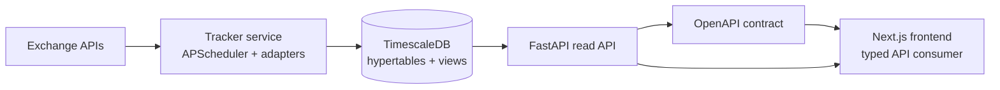
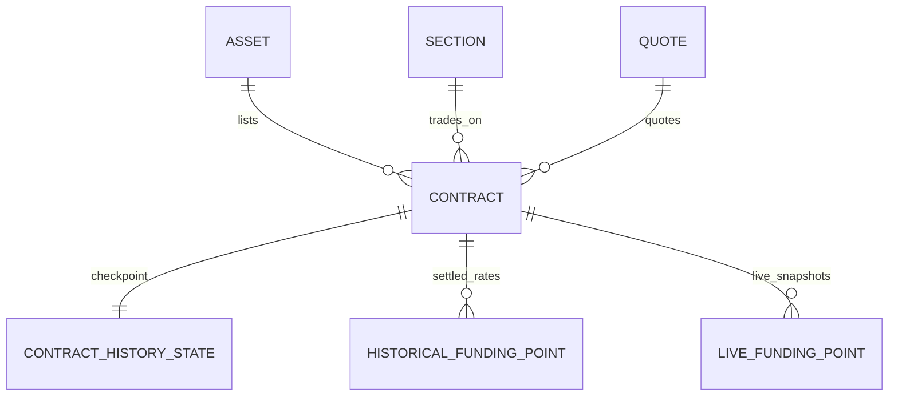

# FundingPulse

FundingPulse is a crypto perpetual futures funding-rate platform. It collects
historical and live funding rates through a registry of exchange adapters,
stores them in TimescaleDB, serves normalized analytics through a FastAPI read
API, and presents the data in a typed Next.js frontend.

- Live product: [quantshark.space](https://quantshark.space/)
- API docs: [api.quantshark.space/docs](https://api.quantshark.space/docs)

The project is intentionally shaped as a small data platform rather than a thin
exchange scraper: ingestion is resumable, writes are idempotent, query paths are
optimized for time-series data, and the frontend is generated from the backend
OpenAPI contract.

## System Shape



The runtime is split into clear boundaries:

- **Tracker** - a long-running ingestion service. It discovers contracts,
  backfills historical funding, collects live rates, and maintains history
  checkpoints per contract.
- **TimescaleDB** - storage for settled and live funding points. Funding tables
  are hypertables; heavier API paths use materialized views and continuous
  aggregates.
- **API** - a read-only FastAPI service exposing metadata, contract search,
  funding series, cross-exchange differences, and funding-wall views.
- **Frontend** - a Next.js App Router UI that consumes generated TypeScript
  types from the backend contract.

## Engineering Highlights

**Resumable ingestion.** Historical sync progress is tracked as explicit
per-contract checkpoints instead of being repeatedly derived from the historical
hypertable. A crash during backfill does not corrupt progress: the next run
resumes from committed bounds and re-fetches overlapping windows safely.

**Idempotent writes.** Funding points are keyed by `(contract_id, timestamp)`.
Bulk inserts ignore conflicts, so exchange pagination overlap and retry behavior
do not duplicate data.

**Exchange diversity behind one boundary.** Each exchange adapter translates
exchange-specific symbols, funding intervals, pagination, and live-rate APIs
into a small internal contract used by the tracker.

**Funding-rate normalization at query time.** Exchanges settle on different
intervals, commonly 1h, 4h, or 8h. The API stores raw rates and normalizes in
SQL when consumers request 1h, 8h, daily, or annualized views.

**A real frontend/backend contract.** FastAPI exports `contracts/openapi.json`;
the frontend generates TypeScript API types from that artifact. Mocked frontend
development uses the same surface instead of a separate hand-written shape.

**Horizontally sharded collection.** Production deployment can fan out tracker
workers through supervisord. Each worker receives an instance id and total
instance count, then processes its own exchange shard.

## Domain Model

The central entity is `Contract`: a unique `(asset, section, quote)` listing
with a funding interval and market metadata. A section represents an exchange
market namespace.



Funding rates are stored as decimals: `0.0001` means `0.01%`. Historical points
represent settled funding payments; live points represent the current unsettled
rate snapshot.

## Running The Project

Create `.env` from the example and start the database stack:

```bash
cp .env.example .env
docker compose up -d timescaledb
uv run alembic upgrade head
```

Run the backend services:

```bash
uv run funding-tracker
uv run uvicorn fundingpulse.api.main:app
```

Run the frontend:

```bash
npm run frontend:dev
```

For frontend work without a live API:

```bash
npm run frontend:dev:mock
```

## Useful Commands

| Purpose | Command |
| --- | --- |
| Run one exchange | `uv run funding-tracker --exchanges bybit` |
| Verify one adapter | `uv run verify hyperliquid` |
| Run backend tests | `uv run pytest` |
| Sync frontend API types | `npm run contract:sync` |
| Run frontend tests | `npm run frontend:test` |
| Build frontend | `npm run frontend:build` |

## Project Map

- [Tracker](fundingpulse/tracker/README.md) - ingestion engine, exchange
  adapters, backfill, live collection, recovery model.
- [API](fundingpulse/api/README.md) - read boundary, endpoint groups, rate
  normalization, OpenAPI contract.
- [Frontend](frontend/README.md) - typed consumer, product views, mock mode,
  generated API types.
- [Testing](fundingpulse/testing/README.md) - real TimescaleDB-backed fixtures
  and helpers.

## Where It Can Grow

The current system already separates collection, storage, query, and UI
boundaries. The natural next product direction is event-driven analysis: alert
rules, rolling windows, and notification workflows over live funding changes.
That layer should be introduced when live load and product behavior justify it,
not as infrastructure for its own sake.
