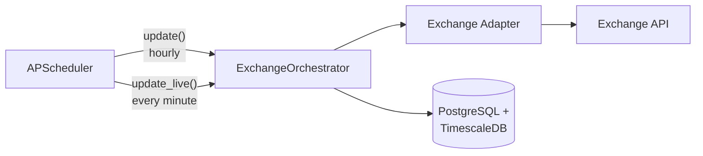
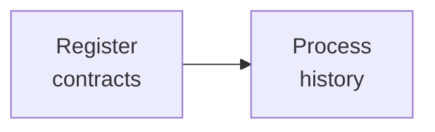
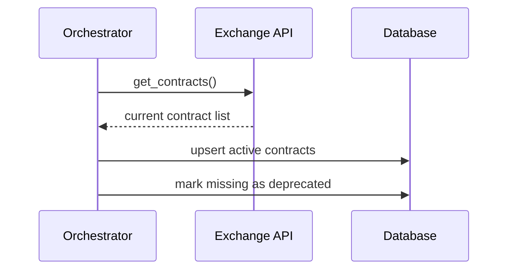
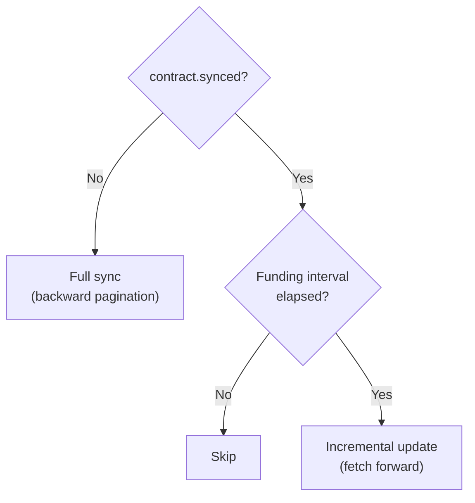
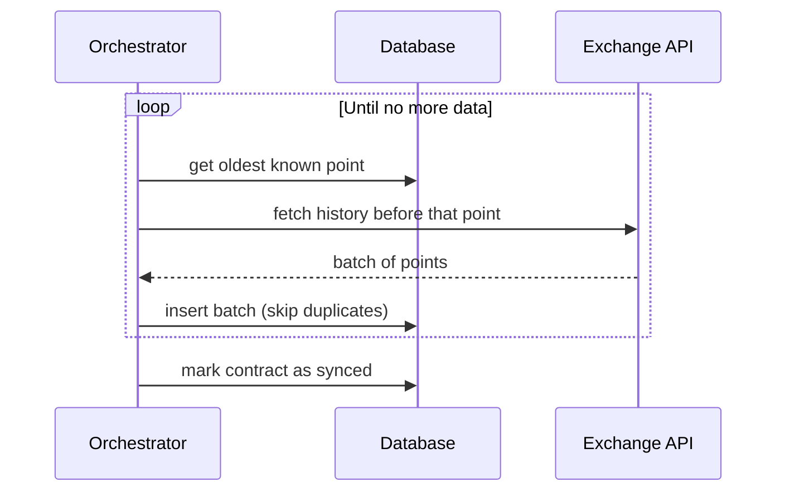

# Tracker

The tracker is a long-running service that collects funding rate data from cryptocurrency perpetual futures exchanges.

It collects two types of data:

- **Historical rates** — settled funding payments: what traders actually paid or earned at the end of each funding interval.
- **Live rates** — current rate that would be charged if the funding interval ended right now.

## Architecture

Bootstrap creates one `ExchangeOrchestrator` per exchange, each with its own concurrency semaphore and exchange adapter. All orchestrators share the same database connection pool.

Live collection jobs are staggered across the minute to spread CPU load from concurrent processing.

## The Update Cycle

`update()` runs hourly and on startup. It performs two steps in sequence:

Contracts are registered first, then each contract is processed concurrently (bounded by a semaphore). The following sections explain why this sequence exists and how each part works.

## Contracts

Exchanges list and delist perpetual contracts at any time — a new trading pair can appear every hour. The tracker cannot collect funding data for a contract it doesn't know about, and live collection depends on the contract list being up to date.

This is why contract registration is the mandatory first step of every update cycle, not a separate process running on its own schedule.

Registration is idempotent: `upsert` ensures repeated runs produce the same result regardless of prior state.

## Historical Data

Each contract can have years of funding history. When the tracker first encounters a contract, it needs a full backfill — fetching all available data from the exchange. After that, only incremental updates are needed.

A single boolean flag `synced` on each contract separates these two modes:

This flag unifies initial backfill and ongoing updates into one code path. No separate sync workflow, no state machine — the orchestrator runs the same logic every cycle, and the flag routes each contract to the right strategy.

### Full sync

Sync fetches history backwards — from the present into the past — because the tracker doesn't know how far back the exchange has data.

Each iteration queries the database for the oldest known point rather than tracking the position in memory. This is a deliberate choice: a cheap query eliminates in-memory state, keeping the loop stateless and naturally resumable after a crash.

Each batch opens and closes its own database session. This avoids holding a connection during API calls that may take seconds, and ensures partial progress is committed — if the process crashes mid-sync, completed batches are already in the database.

### Incremental update

Once synced, the tracker only needs to fetch data newer than its latest known point. It checks whether enough time has passed based on the contract's funding interval, fetches new points in a single request, and inserts them.

## Crash Recovery

Everything described above is designed so that interruption at any point is safe. Three mechanisms make this work:

**`bulk_insert_ignore`** — inserting a point with the same `(contract_id, timestamp)` as an existing one is silently skipped. The tracker can re-fetch overlapping data without corruption.

**`synced` flag** — only set to `True` after backward pagination returns no more data. A crash mid-sync leaves the flag at `False`, so the next run resumes sync automatically.

**Short-lived sessions** — each batch in sync commits independently. Partial progress survives crashes.

| Crash point | Next run behavior |
|---|---|
| During contract registration | Contracts re-fetched, upsert is idempotent |
| During sync (mid-pagination) | `synced` still `False`, resumes from oldest known point |
| During incremental update | Fetches from last committed point again |
| During live collection | Independent loop, next minute collects fresh data |

## Live Collection

`update_live()` runs every minute. It fetches current unsettled funding rates for all active contracts in a single batch API call and bulk-inserts them. This is a simpler, stateless operation — no pagination, no sync tracking.
