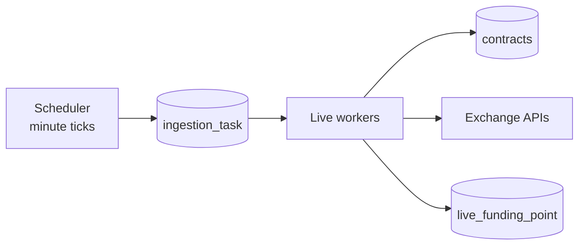

# Ingestion

FundingPulse ingestion is the task-based runtime for live market data. It moves
current funding snapshots out of the tracker scheduler and into a small pipeline:
one scheduler, a Postgres-backed task queue, and universal workers that can
process any enabled exchange.

Live funding is a useful first pipeline because it is unforgiving but bounded.
Every minute matters, missed minutes should not become backlog, and one slow
exchange should not hold the whole system hostage.

## Runtime Shape



The scheduler does not fetch exchange data. It only creates exchange-level live
funding tasks for the current minute. Workers claim pending tasks with row-level
locking, resolve the exchange adapter, load active contracts, fetch current
rates, persist the snapshot, and mark the task done or failed.

One task is one exchange snapshot:

```text
live_funding_snapshot:{exchange}:{scheduled_for}
```

## Queue Semantics

The queue coordinates live work; it is not a backlog system.

- The scheduler creates at most one task per exchange per minute.
- If an exchange already has pending or running work, the next tick skips it.
- Stale running tasks are failed before scheduling new work.
- Workers execute claimed tasks even if the scheduled minute is already in the
  past.
- `live_funding_point` writes are idempotent by `(contract_id, timestamp)`.

This keeps the behavior honest for current-state data: failures are visible, but
they do not rewrite the schedule or create hidden catch-up debt.

## Boundaries

**Scheduler.** `funding-ingestion-scheduler` owns cadence and task creation.

**Worker.** `funding-ingestion-live-worker` owns claim, fetch, persist, and final
task state.

**Adapters.** Ingestion adapters are live-only and expose
`fetch_live(contracts)`. Contract discovery and historical pagination stay with
the tracker until they move through their own pipeline boundaries.

**Logs.** Structured lifecycle events such as `live_task_created`,
`live_task_claimed`, `live_fetch_completed`, `live_persist_completed`, and
`live_task_completed` describe the pipeline without turning the queue table into
an event store.

## Deployment

Docker Compose runs live ingestion as two services:

- `ingestion-scheduler` - one scheduler process;
- `ingestion-live-worker` - a worker container fanned out by supervisord.

Worker fan-out is controlled by:

```bash
LIVE_INGESTION_WORKER_COUNT=3
```

The tracker still owns contract registration, historical sync, materialized-view
refresh, and ranking updates. Legacy tracker live collection is disabled by
default after the ingestion cutover.

## Next Pipelines

Live funding proves the runtime shape. The same pattern can move the remaining
tracker responsibilities when the boundaries are worth it: contract discovery,
historical funding sync, derived-data refreshes, and future event-driven
analysis over live funding changes.
