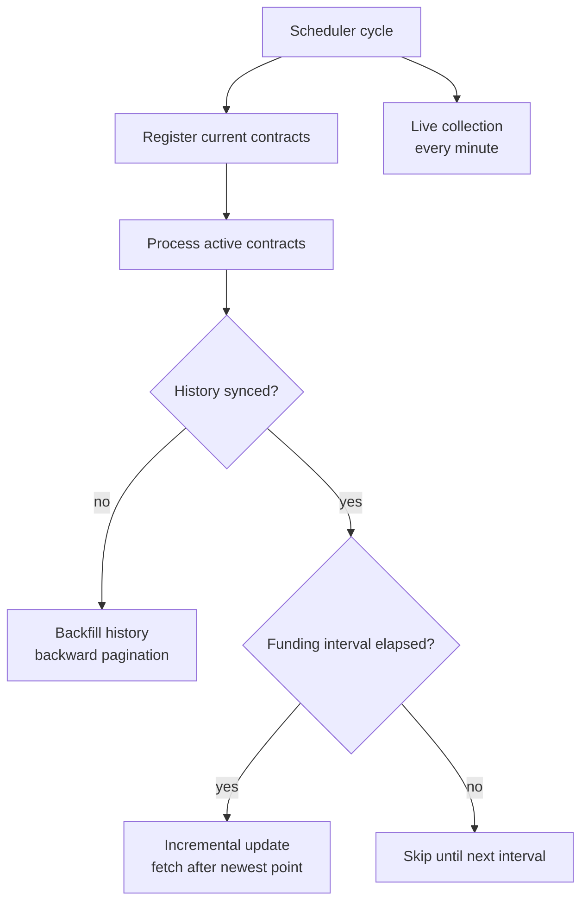

# Tracker

The tracker is the ingestion engine for FundingPulse. It is a long-running
APScheduler service that keeps the database aligned with exchange contract
lists, settled funding history, and current live funding snapshots.

It is deliberately built around recovery and repeatability. Exchange APIs can
fail, pagination windows can overlap, contracts can be listed or delisted at any
time, and a full historical backfill may run for long enough to be interrupted.
The tracker treats those cases as normal operating conditions.

## Runtime Flow



Each exchange gets its own orchestrator, adapter, logger, and concurrency
semaphore. All orchestrators share the same database runtime and HTTP client
scope.

In production, tracker processes can be fanned out through supervisord. The
deployment reads `FT_INSTANCE_COUNT`, starts that many `funding-tracker`
processes, and passes `--instance-id` / `--total-instances` to each one. Each
instance then handles a deterministic shard of the exchange registry.

## Exchange Adapter Boundary

Exchange-specific code lives behind `BaseExchange`. An adapter owns symbol
formatting, API pagination, funding interval detection, and live-rate fetching.
The tracker only depends on internal DTOs:

- `ExchangeContractListing` for available perpetual contracts.
- `FundingPoint` for historical and live funding rates.

The registry validates adapters at import time and exposes the `EXCHANGES`
mapping used by the CLI and scheduler bootstrap.

## Contract Registration

Every update cycle starts by asking the exchange for its current contract list.
That list is reconciled with existing `Contract` rows:

- new contracts are inserted;
- missing contracts are marked deprecated;
- reappeared contracts are reactivated;
- funding interval changes are applied explicitly.

This step is not a separate maintenance job because live collection and history
sync both depend on an accurate contract set.

## Historical Sync

Historical funding has two modes:

- **Backfill** for contracts whose full history is not yet synced. The tracker
  paginates backward from the newest known point until the exchange returns no
  older data.
- **Incremental update** for synced contracts. The tracker fetches points after
  the newest committed timestamp, gated by the contract funding interval.

Progress is stored in `ContractHistoryState`, one row per contract:

- `history_synced` tells whether full backfill completed.
- `oldest_timestamp` and `newest_timestamp` store committed bounds.
- state updates and funding point inserts happen in the same transaction.

The hot path does not derive sync progress by scanning the historical hypertable;
it reads the checkpoint row directly.

## Live Collection

Live collection runs every minute. It fetches current unsettled funding rates for
active contracts and stores them separately from settled historical data. This
keeps live snapshots queryable without mixing them with final funding payments.

Live jobs are intentionally simple and stateless. A failed minute is logged and
the next minute collects a fresh snapshot.

## Crash Recovery

The tracker assumes interruption can happen at any point:

| Crash point | Next run behavior |
| --- | --- |
| Contract registration | Fetches contracts again and reconciles idempotently |
| Historical backfill | Uses `oldest_timestamp` and repeats the last safe window |
| Incremental update | Fetches from the last committed `newest_timestamp` |
| Live collection | Waits for the next minute and writes a new snapshot |

Funding points use `(contract_id, timestamp)` as the identity. Bulk inserts
ignore conflicts, so retrying overlapping windows is safe.

## Verification Tool

`verify` checks exchange adapters against real exchange APIs without starting
the scheduler or touching the database:

```bash
uv run verify hyperliquid
uv run verify --list
uv run verify --all
```

It validates the adapter protocol, fetches contracts, samples historical data,
and checks live-rate fetching. Use it after changing an adapter or when an
exchange API appears to drift.
